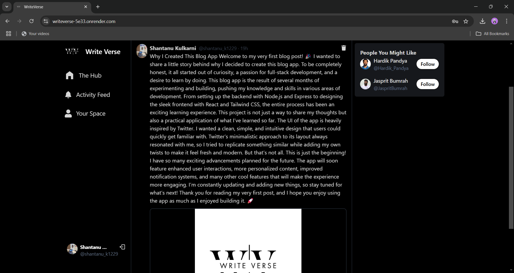
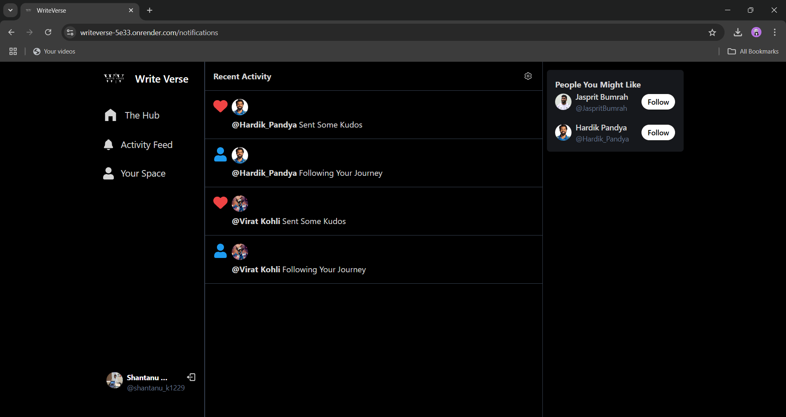

# 🖋️ WriteVerse - Blog Application 🌟  

Welcome to **WriteVerse**, a dynamic blog application designed for creative writers and avid readers. Write, share, and engage with the blogging community through an intuitive platform packed with powerful features!  

---

## ⚡ Features  

- **Write and Share Blogs**: Create engaging blogs and share them with the world.  
- **Image Attachments**: Add images to your blogs using seamless media upload functionality.  
- **Follow Bloggers**: Build your network by following your favorite bloggers.  
- **Like and Comment**: Interact with blogs through likes and comments.  
- **Profile Customization**: Update your profile with a profile picture, cover image, username, and email.  
- **Real-Time Notifications**: Stay updated with notifications about likes, comments, and follows.  

---

## 🛠️ Tech Stack  

### **1. MERN Stack**  
- **MongoDB**: NoSQL database for storing user profiles, blogs, and interactions.  
- **Express.js**: Backend framework for managing APIs and server logic.  
- **React.js**: For building a responsive and user-friendly front-end interface.  
- **Node.js**: Server-side runtime for building scalable and efficient web services.  

### **2. Frontend Libraries and Tools**  
- **@tanstack/react-query**: Efficient data fetching and caching for a seamless user experience.  
- **react-hot-toast**: Beautiful toast notifications for feedback and alerts.  
- **react-icons**: A collection of popular icons for enhancing UI/UX.  
- **react-router-dom**: For dynamic routing and navigation.  
- **tailwindcss & daisyui**: For responsive and customizable UI components.  
- **vite**: A fast development build tool for modern web projects.  

### **3. Backend Libraries and Tools**  
- **bcryptjs**: Securely hash user passwords for authentication.  
- **cloudinary**: For handling media uploads, storage, and optimization.  
- **cookie-parser**: To handle cookies for session management.  
- **cors**: To enable secure cross-origin requests.  
- **dotenv**: For managing environment variables.  
- **jsonwebtoken**: For secure user authentication using tokens.  
- **mongoose**: To model and interact with MongoDB.  

---

## 📚 Why These Technologies?  

- **React.js** and **Tailwind CSS**: For creating an engaging and responsive UI.  
- **React Query**: Simplifies data management, making API interactions smooth.  
- **Cloudinary**: Streamlines image uploads and transformations.  
- **bcryptjs** and **jsonwebtoken**: For robust and secure user authentication.  
- **Express.js** and **Node.js**: A scalable and efficient backend to handle heavy traffic.  

---

## 🌐 Live Demo and Source Code  

- **Live Application**: [WriteVerse Live](https://writeverse-5e33.onrender.com/)  
- **GitHub Repository**: [WriteVerse Code](https://github.com/Shantanu-Kulkarni1229/WriteVerse---Blog-web---Application.git)  

---

## 🚀 How to Run WriteVerse Locally  

1. **Clone the Repository**:  
   ```bash
   git clone <https://github.com/Shantanu-Kulkarni1229/WriteVerse---Blog-web---Application.git>
   cd writeverse
   ```

2. **Install Dependencies**:  
   - For the server:  
     ```bash
     npm install
     ```  
   - For the client:  
     ```bash
     cd client && npm install
     ```  

3. **Set Up Environment Variables**:  
   - Create a `.env` file in the server root directory with the following:  
     ```plaintext
     MONGO_URI=<your-mongodb-uri>
     CLOUDINARY_CLOUD_NAME=<your-cloudinary-cloud-name>
     CLOUDINARY_API_KEY=<your-cloudinary-api-key>
     CLOUDINARY_API_SECRET=<your-cloudinary-api-secret>
     JWT_SECRET=<your-jwt-secret>
     ```

4. **Start the Application**:  
   - Run the server:  
     ```bash
     npm start
     ```  
   - Start the client:  
     ```bash
     cd client && npm run dev
     ```  

5. **Access the Application**:  
   Open your browser and navigate to `http://localhost:5173`.  

---

## 📸 Screenshots  

  
*Write and share your blogs effortlessly.*  

  
*Real-time notifications keep you updated.*  

---

## 💡 What I Learned  

- Enhanced state management and API integration using **React Query**.  
- Securely handled user authentication with **bcryptjs** and **jsonwebtoken**.  
- Simplified media management with **Cloudinary** APIs.  
- Created a responsive and visually appealing UI with **DaisyUI** and **Tailwind CSS**.  
- Built scalable and efficient APIs using **Express.js** and **Node.js**.  

---

## 🤝 Contributing  

We welcome contributions! Here's how you can get started:  
1. Fork the repository.  
2. Create a feature branch:  
   ```bash
   git checkout -b feature/your-feature-name
   ```  
3. Commit your changes:  
   ```bash
   git commit -m "Add your feature or fix"
   ```  
4. Push to the branch:  
   ```bash
   git push origin feature/your-feature-name
   ```  
5. Submit a pull request.  

---

## 🙌 Acknowledgments  

Thanks to the open-source community for providing amazing tools and libraries that made WriteVerse possible.  

---

## 📧 Contact  

Feel free to reach out for any queries or collaboration opportunities:  
**Email**: [shantanukulkarni1229@gmail.com]  
**LinkedIn**: [www.linkedin.com/in/shantanu-kulkarni1229]  

---

**Made with ❤️ and MERN**  
